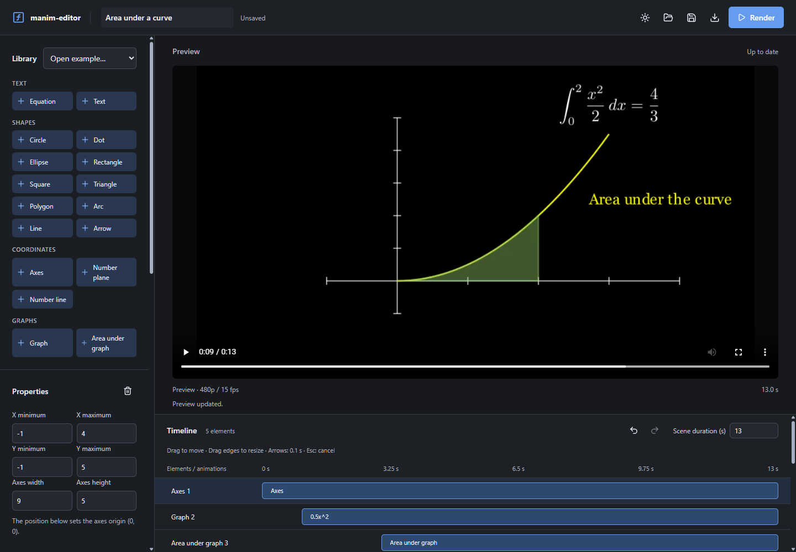
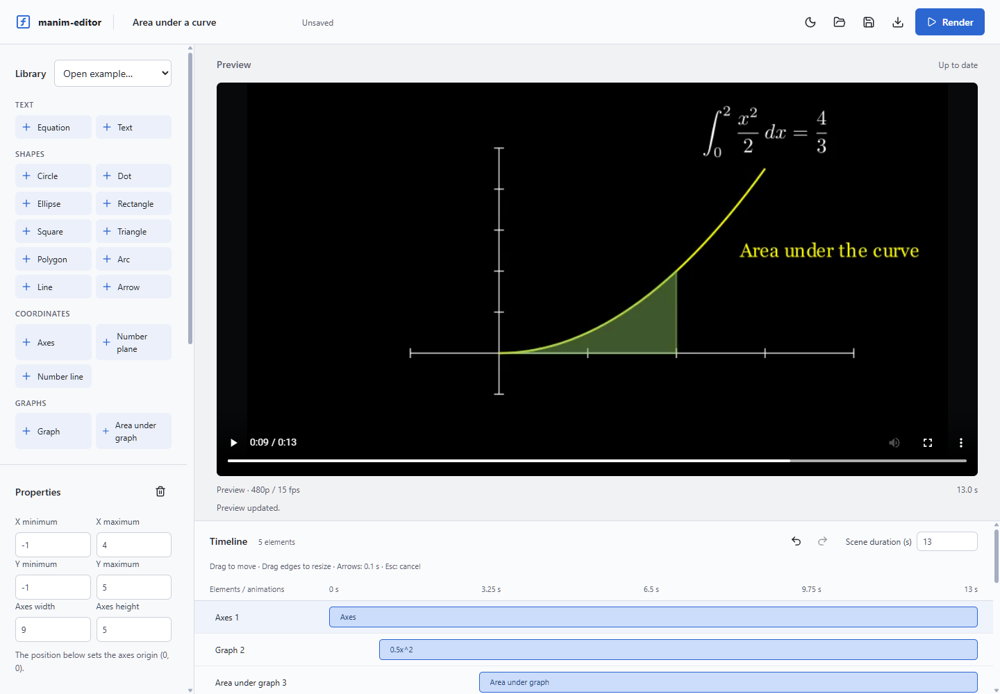
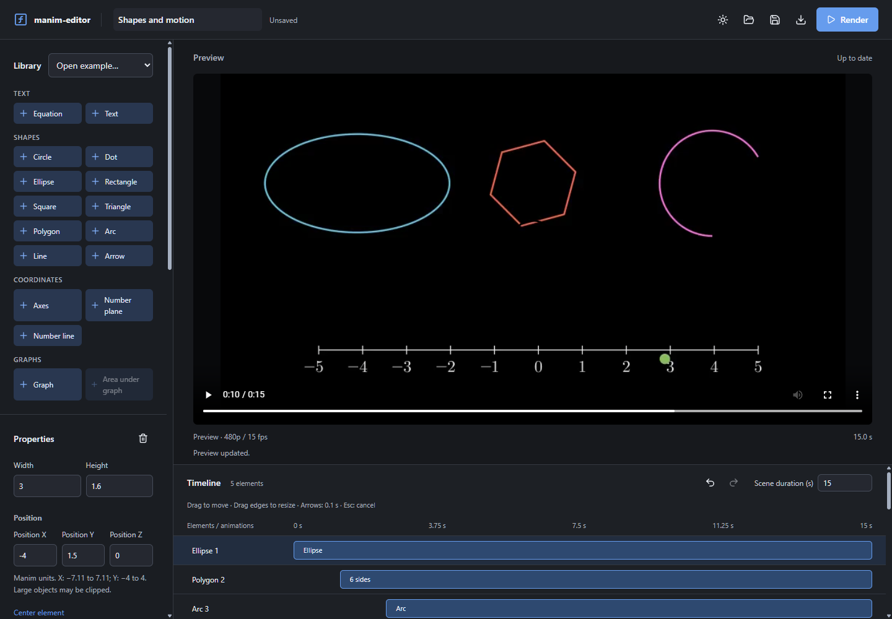
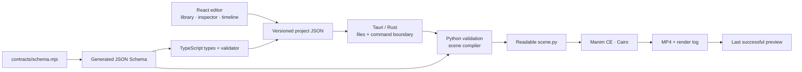

<div align="center">

# manim-editor

**Mathematical animations, built on a timeline.**

Compose the scene visually. Let Manim write the frames.

[](src-tauri/)
[](src/app/)
[](src/domain/)
[](requirements-render.txt)


[The idea](#the-problem-it-takes-seriously) ·
[Demos](#watch-it-render) ·
[Features](#what-you-can-build) ·
[Architecture](#architecture) ·
[Run it](#running-it) ·
[Verification](#what-is-verified) ·
[Limits](#known-limitations)

</div>

---

Build a graph, write its equation, shade an integral, and decide when each piece appears.
manim-editor turns those choices into a versioned project and readable Manim Python,
then renders a real video on your machine.

It is a Windows desktop editor for students and creators who already use Manim and
want to spend less time writing repetitive scene code.



*The actual Tauri app, displaying its own Manim render. Blue tracks describe element
visibility; separate animation tracks control motion. The preview changes only when you render.*

---

## The problem it takes seriously

A mathematical idea can be simple to sketch and tedious to translate into Python:
find the right class, remember its parameters, position the objects, sequence the animations,
render, and repeat.

This editor makes the supported part of that workflow visual. You still choose the
mathematics, the composition, and the timing. Manim still produces the final pixels.

**The goal is less repetitive coding, not a faster rendering engine or complete Manim API coverage.**
Time savings have not been measured in a user study.

## Watch it render

These are original scenes built from the bundled editor projects, using the mathematical
storytelling approach associated with 3Blue1Brown: reveal a construction, connect it to
notation, and direct attention with motion. They are not copied videos or affiliated demos.

### Area under a curve

Draw `f(x) = x² / 2`, reveal the area from 0 to 2, write the exact integral, and emphasize
the relationship with color. The graph and shaded area share the same axes.

[](docs/media/calculus-area.mp4)

[Watch / download MP4](docs/media/calculus-area.mp4) ·
[Editable project](examples/calculus-area.json)

*13 seconds · 854 × 480 · 15 fps · H.264. The GIF is a smaller 10 fps preview of the full video.*

### Shapes and motion

Build an ellipse, polygon, arc, and number line. Move a marker, rotate the polygon,
scale the ellipse, change the arc's color, and finish with emphasis and an exit.

[](docs/media/shape-motion.mp4)

[Watch / download MP4](docs/media/shape-motion.mp4) ·
[Editable project](examples/shape-motion.json)

*15 seconds · 854 × 480 · 15 fps · H.264. No handwritten Python scene is needed.*

GIFs play inline on GitHub; the MP4 links provide the full files.
See [media provenance and reproduction](docs/media/README.md).

## What you can build

| Part of a scene | Available today |
|---|---|
| Text and notation | Plain text, LaTeX equations |
| Shapes | Circle, dot, ellipse, rectangle, square, triangle, regular polygon, arc, line, arrow |
| Coordinates | Axes, number plane, number line |
| Graphs | Function graphs, areas under axis-linked graphs |
| Entrances | Create, Write, FadeIn, GrowFromCenter, DrawBorderThenFill |
| Motion and appearance | MoveTo, Rotate, Scale, SetColor |
| Emphasis and exits | Indicate, Wiggle, FadeOut, Transform |
| Timing | Sequential clips and explicit parallel groups |

That is **17 element kinds and 13 animation kinds**, plus parallel grouping.

- Edit content, position, color, scale, and opacity; positioned elements also expose rotation.
- Drag clips to move them and drag their edges to resize them.
- Set times in **seconds**; the saved contract stores milliseconds.
- Nudge timeline clips by 0.1 seconds with the arrow keys; press Esc to cancel a drag.
- Undo and redo edits, save and reopen JSON projects, and export readable Python.
- Switch between light and dark themes.
- Keep the last successful preview when the next render fails.



*Same project, same rendered video, different workspace theme. The preview reports
“Unrendered changes” when the project no longer matches the video.*

<details>
<summary>See the shapes project in the editor</summary>



</details>

### Mathematical input, not arbitrary Python

Type expressions such as `sin(2x)/2`, `0.5x^2`, or `(x - 2)^2 + 1`.
The parser accepts numbers, parentheses, arithmetic, implicit multiplication, `x`,
`pi`, `e`, and `sin cos tan sqrt abs exp ln log`.

TypeScript and Python use the same [expression fixtures](contracts/expression-cases.json).
Invalid notation identifies its column. A finite sample check catches many undefined
values before rendering; it is not a proof that a function is continuous or defined everywhere.

## Architecture

The editable project is **data, not Python source**. There is no hidden Python editor
behind each control.



| Boundary | Responsibility |
|---|---|
| [React interface](src/app/) | Selection, inspectors, timeline gestures, history, preview state |
| [Domain layer](src/domain/) | Catalog, expression parsing, lifecycle validation, clip editing |
| [Shared contract](contracts/schema.mjs) | Element and animation fields; generates the persisted schema |
| [Rust shell](src-tauri/src/project_commands.rs) | Native dialogs, narrow commands, Python bridge, asset access |
| [Python renderer](renderer/manim_renderer/) | Validate again, compile deterministically, launch Manim, retain diagnostics |

Each render has an isolated directory containing the project snapshot, generated source,
log, and video. Only a successful result replaces the preview.

To add a supported feature, extend the contract, catalog/inspector, and focused compiler,
then test both languages. There is no public plugin system or arbitrary Python block.

## Running it

This is a **development build**, not a self-contained installer. Run these commands from
the repository root in PowerShell.

### Prerequisites

- Node.js and npm; this checkout was verified with Node 24.
- Python; the rendering environment used for these demos is Python 3.14.
- Rust with the MSVC toolchain, C++ build tools, and WebView2:
  follow [Tauri's Windows prerequisites](https://v2.tauri.app/start/prerequisites/).
- The dependencies described in [Manim's installation guide](https://docs.manim.community/en/stable/installation.html).
- A TeX distribution with `latex`, `dvisvgm`, and Manim's template packages.
  The desktop bridge currently expects [TinyTeX](https://yihui.org/tinytex/) under
  `work/runtime/tex/TinyTeX/bin/windows`. It is **not included in Git**.
- FFmpeg and ffprobe on PATH for reproducing the README GIFs and checking the videos.

### Install dependencies and launch

```powershell
npm ci
python -m venv .venv
.\.venv\Scripts\python.exe -m pip install -r requirements-render.txt
npm run tauri -- dev
```

The last command starts Vite and the Tauri desktop window. On the original development
machine, `npm run desktop` selects the repo-local Rust installation under
`work/cargo` and `work/rustup`; that helper does not install Rust for a fresh clone.

Inside the app, choose **Open example → Area under the curve**, then **Render**.
To build your own scene, add an element, edit its properties, and add animations explicitly.

`npm run dev` alone runs the editor in a browser. Native save/open dialogs, Python export,
and rendering require the Tauri app.

### Render without the interface

```powershell
.\.venv\Scripts\python.exe -m renderer.manim_renderer.render_job examples/calculus-area.json --tex-bin work/runtime/tex/TinyTeX/bin/windows
```

The command prints the MP4 path under `work/renders/<job-id>/`. You can supply a different
TeX directory through `--tex-bin` in this CLI. To generate Python without rendering:

```powershell
.\.venv\Scripts\python.exe -m renderer.manim_renderer.cli examples/calculus-area.json
```

## What is verified

Local verification on Windows, **September 7, 2026**:

| Check | Result |
|---|---|
| Frontend domain tests | 28 passing |
| Python compiler, validation, and render-runner tests | 42 passing |
| Browser workflow tests | 12 passing |
| Rust bridge integration tests | 3 passing, including a real render |
| Production frontend build | Passing |
| Rust desktop build | Passing |
| Actual Manim videos | 13 s / 195 frames and 15 s / 225 frames; H.264, 854 × 480, 15 fps |
| Native app workflow | Both examples opened and rendered through Tauri; screenshots captured from WebView2 |

These are local results, not a CI badge or a claim of clean-machine compatibility.
The screenshot capture uses the real desktop bridge, not mocked render responses.

```powershell
npm test
npm run build
npm run test:e2e
.\.venv\Scripts\python.exe -m unittest discover -s renderer/tests -v
cargo test --manifest-path src-tauri/Cargo.toml
```

Browser tests currently select the installed Windows Edge binary in
[playwright.config.ts](playwright.config.ts). Rust integration tests require the local
Python/TeX environment and include a real render.

## Known limitations

- One scene per project; no import of existing Python/Manim projects or round-trip Python editing.
- Preview quality is fixed at 480p / 15 fps. Render again to see edits; there is no live scene renderer.
- MP4 output exists in the render folder; a dedicated Save Video dialog is not implemented.
- Animation blocks cannot partially overlap. Simultaneous animations require an explicit parallel group.
- Linked graphs and shaded areas are compiled from their references; arbitrary animated dependency tracking is not implemented.
- Rendering uses a blocking Python subprocess on a Rust background task. Its timeout is
  `60 + scene duration in seconds × 20`; streaming progress and full process-tree cancellation remain pending.
- The expression language excludes arbitrary Python, but the complete rendering stack is **not a sandbox**.
  Only open and render trusted projects, especially those containing LaTeX.
- Offline packaging, runtime relocation, redistribution-license review, installer signing,
  and validation on a clean Windows machine are still pending. The packaging script is a prototype.
- The original 30–45 second acceptance scenario remains a product target; the shorter demos above
  demonstrate the current implementation, not completion of every release requirement.

## Project notes

- [Media and screenshot reproduction](docs/media/README.md)

Product framing, the full architecture writeup, ADRs, the MVP scope, the design system,
and the implementation progress log are kept as local working notes rather than published
here; ask if you would like to see any of them.

Built on **Manim Community Edition**. This is an independent project, not an official
Manim or 3Blue1Brown application.
