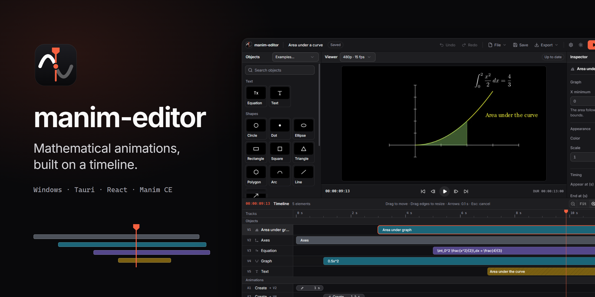
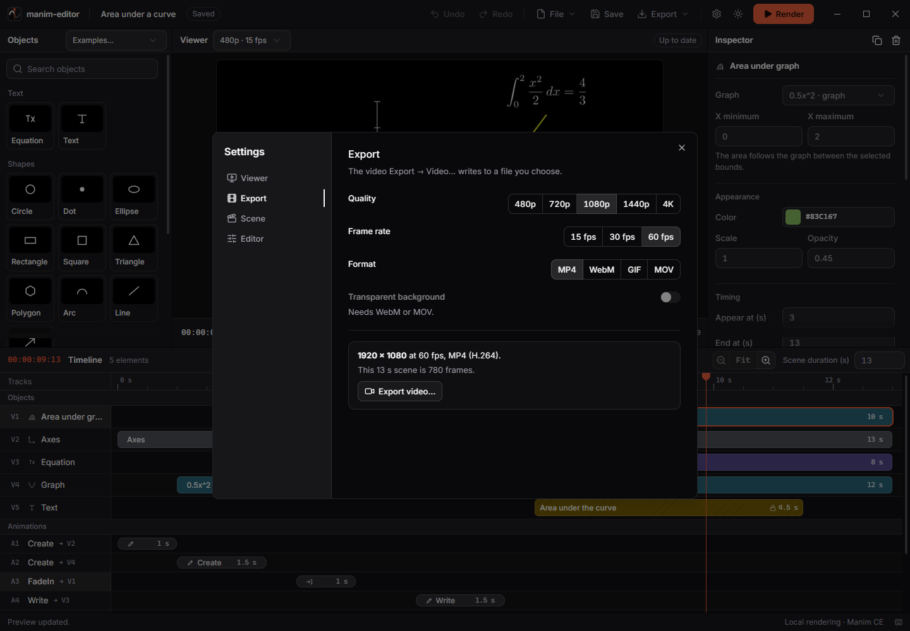
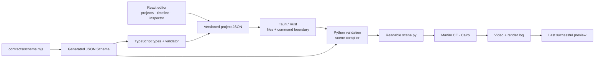

<!-- prettier-ignore -->
<div align="center">



[](https://github.com/diegormirhan/manim-editor/releases/latest)

[](src-tauri/)
[](src/app/)
[](src/domain/)
[](requirements-render.txt)

[Overview](#overview) • [Features](#features) • [Get started](#getting-started) • [How it works](#how-it-works) • [Updates](#publishing-an-update) • [Limitations](#known-limitations)

</div>

Build a graph, write its equation, shade an integral, and decide when each piece appears.
**manim-editor** turns those choices into a versioned project and readable [Manim](https://www.manim.community/)
Python, then renders a real video on your machine.

It is a Windows desktop editor for students and creators who already use Manim and want to spend
less time writing repetitive scene code.

> [!NOTE]
> This is a development MVP and an independent project, not an official Manim or 3Blue1Brown
> application. Rendering is local; nothing is sent to a server.

## Overview

A mathematical idea can be simple to sketch and tedious to translate into Python: find the right
class, remember its parameters, position the objects, sequence the animations, render, repeat.
manim-editor makes the supported part of that workflow visual. You still choose the mathematics,
the composition and the timing; Manim still produces every pixel.


*The real Tauri app showing its own Manim render. Object tracks, coloured by kind, show when each
element is on screen; the animation tracks below control motion. The preview changes only when you render.*

Both demos below were built entirely in the editor, from the bundled [example projects](examples/):

| Area under a curve | Shapes and motion |
|---|---|
| [](docs/media/calculus-area.mp4) | [](docs/media/shape-motion.mp4) |
| Draw `f(x) = x² / 2`, reveal the area from 0 to 2, write the integral. 13 s · 854 × 480 · 15 fps | Build shapes and a number line, then move, rotate, scale, recolour and exit. 15 s · 854 × 480 · 15 fps |

The goal is less repetitive coding, not a faster renderer or complete Manim API coverage.
Time savings have not been measured in a user study.

## Features

- **A timeline, not a form.** Add objects at the playhead, drag clips to move them and their edges
  to resize them, with a live span readout and magnetic snapping to the playhead, the scene bounds
  and other clips. Zoom with Ctrl+wheel; undo and redo everything.
- **Explicit animation.** Adding an element never adds an animation for you. Animations are clips of
  their own: select one, change it, or delete it without touching its object.
- **Render and scrub.** Render (Ctrl+Enter) previews the scene at the viewer quality and reports
  Manim's progress; Esc cancels. A failed render names its cause, such as the LaTeX error, and the
  last good preview stays.
- **Export.** Video at 480p to 4K, 15, 30 or 60 fps, as MP4, WebM, GIF or MOV (transparent in WebM
  and MOV), or the same scene as readable Python.
- **Projects screen.** The app opens on your projects: the one you were working on, recent files
  with thumbnails drawn from their own timelines, and the bundled examples. Unsaved work survives a
  crash or a closed window.
- **A real desktop app.** Its own title bar with Windows 11 caption buttons, a short launch
  animation, light and dark themes that follow the system, and a signed in-app updater.


<details>
<summary>More screenshots</summary>




</details>

### What you can build

| Part of a scene | Available today |
|---|---|
| Text and notation | Plain text, LaTeX equations |
| Shapes | Circle, dot, ellipse, rectangle, square, triangle, regular polygon, arc, line, arrow |
| Coordinates | Axes, number plane, number line |
| Graphs | Function graphs, areas under axis-linked graphs |
| Entrances | Create, Write, FadeIn, GrowFromCenter, DrawBorderThenFill |
| Motion and appearance | MoveTo, Rotate, Scale, SetColor |
| Emphasis and exits | Indicate, Wiggle, FadeOut, Transform |
| Timing | Sequential clips and explicit parallel groups |

Every element accepts colour, scale and opacity; positioned elements also rotate.

> [!TIP]
> Graphs take mathematical notation, never Python: `sin(2x)/2`, `0.5x^2` or `(x - 2)^2 + 1`.
> TypeScript and Python share the same [expression fixtures](contracts/expression-cases.json), and an
> invalid expression points at its column.

## Getting started

### Prerequisites

- [Node.js](https://nodejs.org/) and npm (verified with Node 24).
- [Python](https://www.python.org/) 3.14 for the rendering environment.
- Rust with the MSVC toolchain, C++ build tools and WebView2: see
  [Tauri's Windows prerequisites](https://v2.tauri.app/start/prerequisites/).
- The system dependencies in [Manim's installation guide](https://docs.manim.community/en/stable/installation.html).
- A TeX distribution with `latex`, `dvisvgm` and Manim's template packages. The desktop bridge expects
  [TinyTeX](https://yihui.org/tinytex/) under `work/runtime/tex/TinyTeX/bin/windows`, which is not in Git.

### Install and run

From the repository root, in PowerShell:

```powershell
npm ci
python -m venv .venv
.\.venv\Scripts\python.exe -m pip install -r requirements-render.txt
npm run tauri -- dev
```

The app opens on **Projects**. Choose the **Area under the curve** example, then **Render**. To build
your own scene, choose **New project**, add an element, edit it, and add animations explicitly.

> [!TIP]
> `npm run dev` serves the whole interface at `http://127.0.0.1:1420` in any Chromium browser, with
> no Rust build. Only what needs the operating system (open, save, export, render) is unavailable,
> and it says so. Use this loop for UI work and the Tauri window for rendering and files.

### Render without the interface

```powershell
.\.venv\Scripts\python.exe -m renderer.manim_renderer.render_job examples/calculus-area.json --tex-bin work/runtime/tex/TinyTeX/bin/windows
.\.venv\Scripts\python.exe -m renderer.manim_renderer.render_job examples/calculus-area.json --tex-bin work/runtime/tex/TinyTeX/bin/windows --resolution 1080p --fps 60 --format webm --transparent
.\.venv\Scripts\python.exe -m renderer.manim_renderer.cli examples/calculus-area.json
```

The first two print the video path under `work/renders/<job-id>/`; the last prints the generated
Python. The choices are listed once, in [contracts/render-options.json](contracts/render-options.json).

## How it works

The editable project is **data, not Python source**. One versioned JSON document is the source of
truth; Python is a deterministic, one-way output.


```mermaid
flowchart LR
    UI["React editor<br/>projects · timeline · inspector"] --> Project["Versioned project JSON"]
    Spec["contracts/schema.mjs"] --> Schema["Generated JSON Schema"]
    Schema --> Frontend["TypeScript types + validator"]
    Frontend --> Project
    Project --> Rust["Tauri / Rust<br/>files + command boundary"]
    Rust --> Python["Python validation<br/>scene compiler"]
    Schema --> Python
    Python --> Source["Readable scene.py"]
    Source --> Manim["Manim CE · Cairo"]
    Manim --> Video["Video + render log"]
    Video --> Preview["Last successful preview"]
```

| Boundary | Responsibility |
|---|---|
| [React interface](src/app/) | Projects screen, timeline gestures, inspectors, history, preview state |
| [UI components](src/components/ui/) | shadcn/ui (new-york, zinc) on Tailwind v4 and Radix, owned in the repo |
| [Domain layer](src/domain/) | Catalog, expression parsing, lifecycle validation, clip editing, settings |
| [Shared contract](contracts/) | Element and animation fields, render options; generates the persisted schema |
| [Rust shell](src-tauri/src/project_commands.rs) | Native dialogs, narrow commands, Python bridge, progress, cancellation |
| [Python renderer](renderer/manim_renderer/) | Validate again, compile deterministically, launch Manim, keep diagnostics |

Each render runs in an isolated directory holding the project snapshot, the generated source, the
log and the video, and only a successful result replaces the preview. To add a feature, extend the
contract, the catalog or inspector and the focused compiler, then test both languages.

## Publishing an update

Installed copies read
`https://github.com/diegormirhan/manim-editor/releases/latest/download/latest.json` on every launch.
When it lists a newer version, a banner offers to download it; the installer's signature is checked
against the public key in [tauri.conf.json](src-tauri/tauri.conf.json) before it runs.

1. Raise `version` in [package.json](package.json); Tauri reads it from there.
2. Run `npm run build:installers`. It signs the installers with `%USERPROFILE%\.tauri\manim-editor.key`
   (or `TAURI_SIGNING_PRIVATE_KEY_PATH`) and writes `src-tauri/target/release/bundle/latest.json`.
   Add release notes with `npm run release:manifest -- --notes "What changed"`.
3. Create the GitHub release `v<version>` and attach `latest.json`, the `…_x64-setup.exe` and the
   `…_x64_en-US.msi`.

> [!WARNING]
> Keep a backup of the private key. Without it, installed copies can never be updated again; a new
> key pair means replacing `pubkey` and reinstalling by hand.

## Testing

```powershell
npm test                                                           # domain tests (Vitest)
npm run test:e2e                                                   # browser workflows (Playwright, Edge)
.\.venv\Scripts\python.exe -m unittest discover -s renderer/tests  # compiler, render runner, bridge
cargo test --manifest-path src-tauri/Cargo.toml                    # Rust bridge, includes a real render
```

| Check | Local result |
|---|---|
| Domain, Python and Rust tests | 46, 61 and 13 passing; Rust includes a real render, a cancelled render, a transparent MOV export and a recent file reopened without a dialog |
| Browser workflows | 62 passing against a simulated desktop: projects, recent files, window controls, updates, render, export, progress, settings |
| Exported formats (ffprobe) | 720p30 and 1080p60 H.264, GIF, VP9 with alpha, QuickTime Animation ARGB; a 15 s scene renders exactly 450 frames at 30 fps and 900 at 60 |
| The Tauri window | Real renders, Esc cancellation, LaTeX failures named, caption buttons, recent files saved in place, a tampered update refused, a signed one downloaded, verified and launched |

These are local results, not a CI badge or a clean-machine guarantee. The screenshots come from the
real app with fresh Manim renders; see [media provenance](docs/media/README.md).

## Known limitations

- One scene per project. Existing Manim Python cannot be imported, and exported Python is not read back.
- Render again to see edits; there is no live renderer. Timing sits on a 15 fps grid, so exports use
  15, 30 or 60 fps, and progress advances once per finished Manim segment.
- Animations cannot partially overlap; simultaneous animations need an explicit parallel group.
- Packaging relocation, licence review of the bundled runtime, Authenticode signing and a clean-machine
  check are still pending. The portable zip does not update itself.
- Windows 11's Snap Layouts flyout does not open from the custom maximize button; Win+Z still works.

> [!IMPORTANT]
> The expression language excludes arbitrary Python, but the rendering stack is **not a sandbox**.
> Only open and render projects you trust, especially ones containing LaTeX.

## Resources

- [Manim Community documentation](https://docs.manim.community/)
- [Tauri 2 documentation](https://v2.tauri.app/) and its [updater plugin](https://v2.tauri.app/plugin/updater/)
- [shadcn/ui](https://ui.shadcn.com/), the component system the interface is built from
- [Media and screenshot reproduction](docs/media/README.md)
- [Example projects](examples/)
