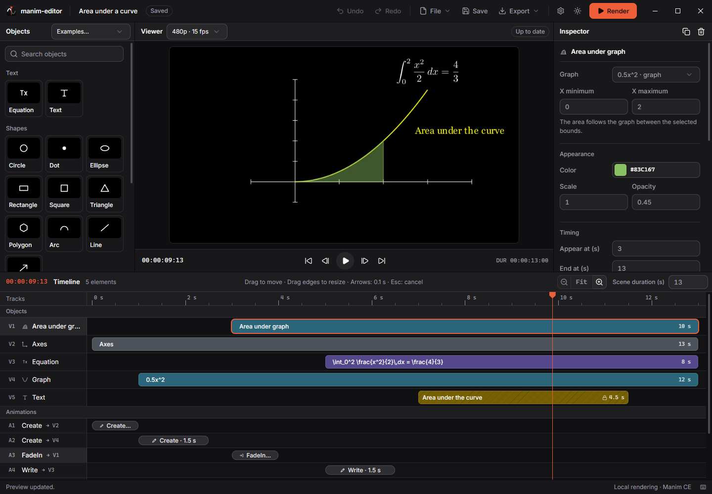
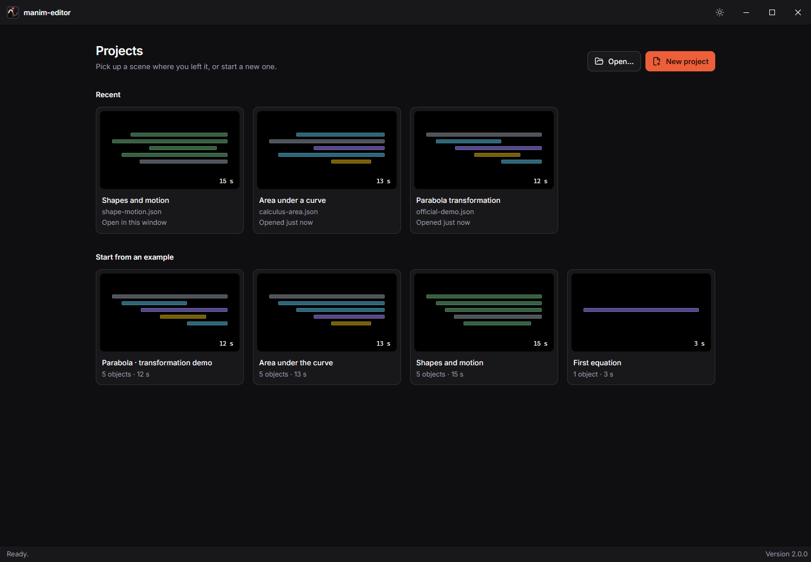
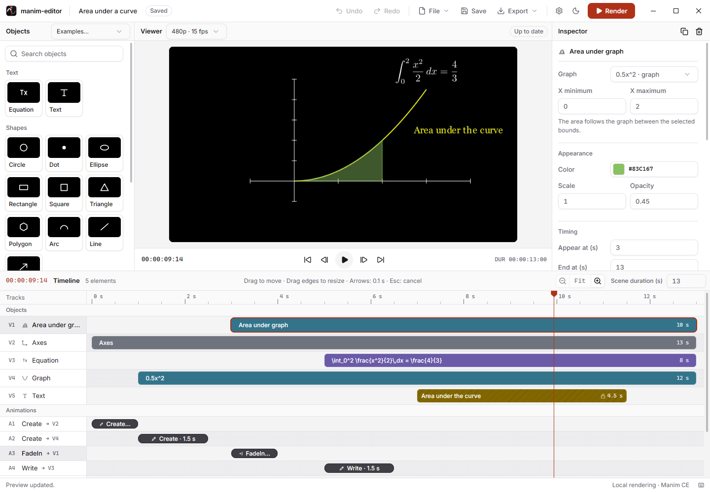
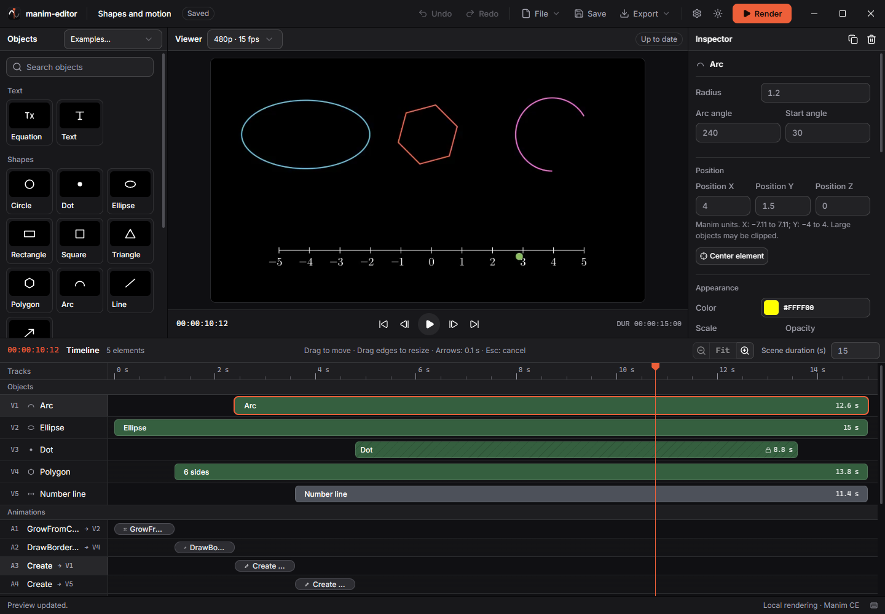
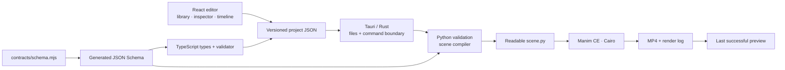

<div align="center">

# manim-editor

**Mathematical animations, built on a timeline.**

Compose the scene visually. Let Manim write the frames.

[](src-tauri/)
[](src/app/)
[](src/domain/)
[](requirements-render.txt)


[The idea](#the-problem-it-takes-seriously) ·
[Demos](#watch-it-render) ·
[Features](#what-you-can-build) ·
[Architecture](#architecture) ·
[Run it](#running-it) ·
[Verification](#what-is-verified) ·
[Limits](#known-limitations)

</div>

---

Build a graph, write its equation, shade an integral, and decide when each piece appears.
manim-editor turns those choices into a versioned project and readable Manim Python,
then renders a real video on your machine.

It is a Windows desktop editor for students and creators who already use Manim and
want to spend less time writing repetitive scene code.



*The actual Tauri app, displaying its own Manim render. Object tracks, coloured by kind, show
when each element is on screen; the animation tracks below them control motion. The preview
changes only when you render.*

---

## The problem it takes seriously

A mathematical idea can be simple to sketch and tedious to translate into Python:
find the right class, remember its parameters, position the objects, sequence the animations,
render, and repeat.

This editor makes the supported part of that workflow visual. You still choose the
mathematics, the composition, and the timing. Manim still produces the final pixels.

**The goal is less repetitive coding, not a faster rendering engine or complete Manim API coverage.**
Time savings have not been measured in a user study.

## Watch it render

These are original scenes built from the bundled editor projects, using the mathematical
storytelling approach associated with 3Blue1Brown: reveal a construction, connect it to
notation, and direct attention with motion. They are not copied videos or affiliated demos.

### Area under a curve

Draw `f(x) = x² / 2`, reveal the area from 0 to 2, write the exact integral, and emphasize
the relationship with color. The graph and shaded area share the same axes.

[](docs/media/calculus-area.mp4)

[Watch / download MP4](docs/media/calculus-area.mp4) ·
[Editable project](examples/calculus-area.json)

*13 seconds · 854 × 480 · 15 fps · H.264. The GIF is a smaller 10 fps preview of the full video.*

### Shapes and motion

Build an ellipse, polygon, arc, and number line. Move a marker, rotate the polygon,
scale the ellipse, change the arc's color, and finish with emphasis and an exit.

[](docs/media/shape-motion.mp4)

[Watch / download MP4](docs/media/shape-motion.mp4) ·
[Editable project](examples/shape-motion.json)

*15 seconds · 854 × 480 · 15 fps · H.264. No handwritten Python scene is needed.*

GIFs play inline on GitHub; the MP4 links provide the full files.
See [media provenance and reproduction](docs/media/README.md).

## What you can build

| Part of a scene | Available today |
|---|---|
| Text and notation | Plain text, LaTeX equations |
| Shapes | Circle, dot, ellipse, rectangle, square, triangle, regular polygon, arc, line, arrow |
| Coordinates | Axes, number plane, number line |
| Graphs | Function graphs, areas under axis-linked graphs |
| Entrances | Create, Write, FadeIn, GrowFromCenter, DrawBorderThenFill |
| Motion and appearance | MoveTo, Rotate, Scale, SetColor |
| Emphasis and exits | Indicate, Wiggle, FadeOut, Transform |
| Timing | Sequential clips and explicit parallel groups |

That is **17 element kinds and 13 animation kinds**, plus parallel grouping.

- Edit content, position, color, scale, and opacity; positioned elements also expose rotation.
- Add objects **at the playhead**; an object never appears in the middle of a running animation.
- Drag clips to move them and drag their edges to resize them. The new span is read out while
  you drag, and edges lock onto the playhead, the scene bounds and other clips' edges, with a
  guide line before you release. Esc cancels; arrow keys nudge a focused clip by 0.1 seconds.
- Zoom the timeline with Ctrl+wheel, `=` / `−`, or the heading buttons; `\` fits the scene again.
- Select an animation on its own: Delete removes that clip, not its object, and the inspector
  brings its settings into view. Removing a Transform also removes the destination it created.
- Set times in **seconds**; the saved contract stores milliseconds.
- Undo and redo edits; typing in a field undoes as one step.
- The app opens on **Projects**, like a video editor's project manager: the project you were
  working on (unsaved work included), recent files with a thumbnail drawn from their own timeline,
  and the bundled examples, beside **Open…** and **New project**. Recent files reopen without a dialog.
- **File** holds New, Open, Save as and All projects; **Save** writes in place after the first save.
  Switching documents with unsaved changes asks first; your session is recovered after a crash.
- The window draws its own title bar: the logo and name on the left, Windows 11 minimize, maximize
  and close on the right, on the same row as the project commands. Drag it to move the window and
  double-click it to maximize.
- **Render** previews the scene at the viewer quality and reports Manim's progress as it finishes
  each segment; Esc cancels. A failed render names its cause, such as the LaTeX error, and the last
  successful preview stays.
- **Export → Video…** writes the scene to a file you choose at the export quality: 480p to 4K,
  15, 30 or 60 fps, as MP4 (H.264), WebM (VP9), GIF or MOV, with a transparent background in WebM
  and MOV. **Export → Python script…** writes the same scene as readable Manim code.
- **Settings** (Ctrl+,) holds the viewer quality and frame rate, play-after-render and loop, the export
  quality, the scene background (saved with the project), the theme (system, light or dark), clip
  snapping (Alt inverts it while dragging) and session recovery.
- Play, scrub and step the preview by frame or by second from the keyboard; press `?` for every shortcut.
- **Updates:** each launch reads `latest.json` from the latest GitHub release. When it lists a newer
  version, a banner drops from the top of the window; **Update and restart** downloads the installer,
  checks its signature against the public key built into the app, and installs it.



*Where every session starts. Each thumbnail is the project's own timeline: one bar per object,
coloured by kind, on the scene's background.*



*Same project, same rendered video, different workspace theme. The preview reports
“Changes not rendered” when the project no longer matches the video.*

<details>
<summary>See the shapes project in the editor</summary>



</details>

### Mathematical input, not arbitrary Python

Type expressions such as `sin(2x)/2`, `0.5x^2`, or `(x - 2)^2 + 1`.
The parser accepts numbers, parentheses, arithmetic, implicit multiplication, `x`,
`pi`, `e`, and `sin cos tan sqrt abs exp ln log`.

TypeScript and Python use the same [expression fixtures](contracts/expression-cases.json).
Invalid notation identifies its column. A finite sample check catches many undefined
values before rendering; it is not a proof that a function is continuous or defined everywhere.

## Architecture

The editable project is **data, not Python source**. There is no hidden Python editor
behind each control.


```mermaid
flowchart LR
    UI["React editor<br/>library · inspector · timeline"] --> Project["Versioned project JSON"]
    Spec["contracts/schema.mjs"] --> Schema["Generated JSON Schema"]
    Schema --> Frontend["TypeScript types + validator"]
    Frontend --> Project
    Project --> Rust["Tauri / Rust<br/>files + command boundary"]
    Rust --> Python["Python validation<br/>scene compiler"]
    Schema --> Python
    Python --> Source["Readable scene.py"]
    Source --> Manim["Manim CE · Cairo"]
    Manim --> Video["MP4 + render log"]
    Video --> Preview["Last successful preview"]
```

| Boundary | Responsibility |
|---|---|
| [React interface](src/app/) | Selection, inspectors, timeline gestures, history, preview state |
| [UI components](src/components/ui/) | shadcn/ui (new-york, zinc) on Tailwind v4 and Radix, owned in the repo |
| [Domain layer](src/domain/) | Catalog, expression parsing, lifecycle validation, clip editing |
| [Shared contract](contracts/schema.mjs) | Element and animation fields; generates the persisted schema |
| [Rust shell](src-tauri/src/project_commands.rs) | Native dialogs, narrow commands, Python bridge, asset access |
| [Python renderer](renderer/manim_renderer/) | Validate again, compile deterministically, launch Manim, retain diagnostics |

Each render has an isolated directory containing the project snapshot, generated source,
log, and video. Only a successful result replaces the preview.

To add a supported feature, extend the contract, catalog/inspector, and focused compiler,
then test both languages. There is no public plugin system or arbitrary Python block.

## Running it

This is a **development build**, not a self-contained installer. Run these commands from
the repository root in PowerShell.

### Prerequisites

- Node.js and npm; this checkout was verified with Node 24.
- Python; the rendering environment used for these demos is Python 3.14.
- Rust with the MSVC toolchain, C++ build tools, and WebView2:
  follow [Tauri's Windows prerequisites](https://v2.tauri.app/start/prerequisites/).
- The dependencies described in [Manim's installation guide](https://docs.manim.community/en/stable/installation.html).
- A TeX distribution with `latex`, `dvisvgm`, and Manim's template packages.
  The desktop bridge currently expects [TinyTeX](https://yihui.org/tinytex/) under
  `work/runtime/tex/TinyTeX/bin/windows`. It is **not included in Git**.
- FFmpeg and ffprobe on PATH for reproducing the README GIFs and checking the videos.

### Install dependencies and launch

```powershell
npm ci
python -m venv .venv
.\.venv\Scripts\python.exe -m pip install -r requirements-render.txt
npm run tauri -- dev
```

The last command starts Vite and the Tauri desktop window. On the original development
machine, `npm run desktop` selects the repo-local Rust installation under
`work/cargo` and `work/rustup`; that helper does not install Rust for a fresh clone.

The app opens on **Projects**: choose the **Area under the curve** example, then **Render**.
To build your own scene, choose **New project**, add an element, edit its properties, and add
animations explicitly.

### Work on the interface without launching the app

```powershell
npm run dev
```

This serves the editor at `http://127.0.0.1:1420` in any Chromium or Edge window, with no
Rust build and no Tauri window. The whole interface is real — library, search, inspector,
timeline dragging, the playhead, undo/redo, themes — because the domain layer is plain
TypeScript and never imports Tauri. Only the four operations that need the operating
system (open, save, export Python, render) are unavailable; they say so instead of
pretending. `.claude/launch.json` points editor tooling at the same server.

The browser tests go one step further: [desktop-mock.ts](tests/browser/desktop-mock.ts)
stands in for the Tauri runtime, so rendering, cancelling, failures, Save / Save as, Open
over unsaved changes, and export are exercised in Edge against a real bundled MP4.

Use this loop for UI work, and the Tauri window when a change touches rendering or files.

### Render without the interface

```powershell
.\.venv\Scripts\python.exe -m renderer.manim_renderer.render_job examples/calculus-area.json --tex-bin work/runtime/tex/TinyTeX/bin/windows
.\.venv\Scripts\python.exe -m renderer.manim_renderer.render_job examples/calculus-area.json --tex-bin work/runtime/tex/TinyTeX/bin/windows --resolution 1080p --fps 60 --format webm --transparent
```

The command prints the video path under `work/renders/<job-id>/`. `--resolution` takes 480p to
2160p, `--fps` 15, 30 or 60, and `--format` mp4, webm, gif or mov, as listed in
[contracts/render-options.json](contracts/render-options.json). You can supply a different TeX
directory through `--tex-bin`. To generate Python without rendering:

```powershell
.\.venv\Scripts\python.exe -m renderer.manim_renderer.cli examples/calculus-area.json
```

### Publish an update

Installed copies check
`https://github.com/diegormirhan/manim-editor/releases/latest/download/latest.json` on every
launch. The installers are signed for the updater with a private key that never enters the
repository; the matching public key is in [tauri.conf.json](src-tauri/tauri.conf.json).

1. Raise `version` in [package.json](package.json); Tauri reads it from there.
2. Run `npm run build:installers`. [desktop.ps1](scripts/desktop.ps1) signs with
   `%USERPROFILE%\.tauri\manim-editor.key` unless `TAURI_SIGNING_PRIVATE_KEY_PATH` or
   `TAURI_SIGNING_PRIVATE_KEY` points elsewhere, then writes
   `src-tauri/target/release/bundle/latest.json`. Add release notes with
   `npm run release:manifest -- --notes "What changed"`.
3. Create the GitHub release `v<version>` and attach `latest.json`, the NSIS `…_x64-setup.exe`
   and the `…_x64_en-US.msi`.

Keep a backup of the private key: without it, installed copies can never be updated again.
A new key pair (`npx tauri signer generate`) means replacing `pubkey` and reinstalling by hand.

## What is verified

Local verification on Windows, **October 4, 2026**:

| Check | Result |
|---|---|
| Frontend domain tests | 46 passing |
| Python compiler, validation, render-runner and bridge tests | 61 passing |
| Browser workflow tests | 60 passing, including the projects screen, recent files, window controls, the update banner, render, export, progress, cancel, save, open and settings through a simulated desktop |
| Rust bridge integration tests | 13 passing, including a real render, a real cancelled render, a real transparent MOV export and a recent file reopened without a dialog |
| Production frontend build | Passing |
| Rust desktop build | Passing |
| Actual Manim videos | 13 s / 195 frames and 15 s / 225 frames; H.264, 854 × 480, 15 fps |
| Export formats (ffprobe) | 3 s scene: 720p30 H.264 90 frames, 1080p60 H.264 180, 480p15 GIF 45, 720p30 VP9 with alpha 90, 480p30 QuickTime Animation ARGB 90; a 15 s scene renders exactly 450 frames at 30 fps and 900 at 60 |
| Native app workflow | In the Tauri window: a real render played back, a second render cancelled with Esc, invalid LaTeX reported as “LaTeX error: Missing } inserted.”, and a 720p / 30 fps preview chosen in Settings rendered at 1280 × 720 while progress rose segment by segment |
| Title bar and projects | In the Tauri window: no system caption, Maximize, Restore down, Minimize and Close acting on the window, and a recent file reopened and saved in place through Rust and Python |
| Updater | In the Tauri window against a local manifest: an installer whose bytes no longer match its signature refused (“The signature verification failed”), and a correctly signed one downloaded, verified and launched while the app closed |

These are local results, not a CI badge or a claim of clean-machine compatibility.
The screenshot capture uses the real desktop bridge, not mocked render responses.

```powershell
npm test
npm run build
npm run test:e2e
.\.venv\Scripts\python.exe -m unittest discover -s renderer/tests -v
cargo test --manifest-path src-tauri/Cargo.toml
```

Browser tests currently select the installed Windows Edge binary in
[playwright.config.ts](playwright.config.ts). Rust integration tests require the local
Python/TeX environment and include a real render.

## Known limitations

- One scene per project; no import of existing Python/Manim projects or round-trip Python editing.
- Render again to see edits; there is no live scene renderer. Timing stays on a 15 fps grid, so
  output frame rates are 15, 30 or 60.
- Render progress counts finished Manim segments, so a single long animation advances in one step.
- Animation blocks cannot partially overlap. Simultaneous animations require an explicit parallel group.
- Linked graphs and shaded areas are compiled from their references; arbitrary animated dependency tracking is not implemented.
- Rendering uses a Python subprocess on a Rust background task. Its timeout is
  `60 + scene duration in seconds × 20`, scaled by the pixels and frames of the chosen quality.
  Cancellation stops the whole process tree.
- The expression language excludes arbitrary Python, but the complete rendering stack is **not a sandbox**.
  Only open and render trusted projects, especially those containing LaTeX.
- Offline packaging, runtime relocation, redistribution-license review, Authenticode signing of the
  installers, and validation on a clean Windows machine are still pending. The packaging script is a
  prototype. The updater's own signature is in place; SmartScreen may still warn on first install.
- The portable zip does not update itself: it has no installer to replace, so it never shows the banner.
- Windows 11's Snap Layouts flyout does not open from the custom maximize button; Win+Z and dragging
  the title bar to a screen edge still snap the window.
- The original 30–45 second acceptance scenario remains a product target; the shorter demos above
  demonstrate the current implementation, not completion of every release requirement.

## Project notes

- [Media and screenshot reproduction](docs/media/README.md)

Product framing, the full architecture writeup, ADRs, the MVP scope, the design system,
and the implementation progress log are kept as local working notes rather than published
here; ask if you would like to see any of them.

Built on **Manim Community Edition**. This is an independent project, not an official
Manim or 3Blue1Brown application.
